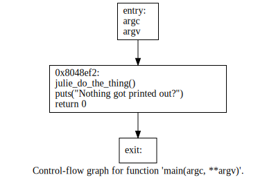

Varrick
===========
This problem took a while to get, but I did eventually figure it out. For this challenge we are given a binary, titled 'varrick'.
The first thing I did was a basic analysis of it, check if the flag was stored in the binary:
``` zsh
18:58:24 david@redacted varrick strings varrick
/lib/ld-linux.so.2
libc.so.6
_IO_stdin_used
puts
__stack_chk_fail
__libc_start_main
__gmon_start__
GLIBC_2.0
GLIBC_2.4
PTRh
[^_]
[^_]
Nothing got printed out?
;*2$"
```
Nothing very useful here, we do see that the program will print something out using puts(). I ran the program:
```
18:58:29 david@redacted varrick ./varrick
Nothing got printed out?
```
Interesting, the program doesn't seem to take any arguments and prints out the same thing every time. I decompiled it 
using [Retargetable Decompiler](https://retdec.com/). 
We see this for main()

So this confirms my assumption that 'Nothing printed out' was printed regardless of input.
So what does julie_do_the_thing actually do? Well, it's actually very hard to tell. 
The function looks like this
``` C
int32_t julie_do_the_thing(void) {
    int32_t v1 = *(int32_t *)20; // 0x8048e70
    int32_t * v2;
    memcpy((char *)v2, (char *)0x8048fe0, 26);
    // branch -> 0x8048e9e
    for (int32_t i = 0; i < 26; i++) {
        // 0x8048e9e
        ((int32_t (*)(int32_t))*(int32_t *)v2[i])(i);
        // continue -> 0x8048e9e
    }
    int32_t v3 = *(int32_t *)20; // 0x8048eda
    if (v3 != v1) {
        // 0x8048ee2
        __stack_chk_fail();
        // branch -> 0x8048ee7
    }
    // 0x8048ee7
    return v3 ^ v1;
}
```
The function seems like nonsense, but what's interesting to note is that it returns: v3 ^ v1.
This is important because it doesn't seem to actually do anything with that value.
If we look at main
``` C
int main(int argc, char ** argv) {
    // 0x8048ef2
    julie_do_the_thing();
    puts("Nothing got printed out?");
    return 0;
}
```
We can see it actually never outputs the value it returns?
So what purpose does it serve? Well, Let's see what it's going to return.  
Things are pushed onto the stack before being used, or just stored in a register, so I would have to set a break point just before the return 
From retdec we can see the address before ret is 8048ee7
I loaded up gdb
``` zsh
8:59:36 david@redacted varrick gdb varrick
GNU gdb (GDB) 7.4.1-debian
Copyright (C) 2012 Free Software Foundation, Inc.
License GPLv3+: GNU GPL version 3 or later <http://gnu.org/licenses/gpl.html>
This is free software: you are free to change and redistribute it.
There is NO WARRANTY, to the extent permitted by law.  Type "show copying"
and "show warranty" for details.
This GDB was configured as "x86_64-linux-gnu".
For bug reporting instructions, please see:
<http://www.gnu.org/software/gdb/bugs/>...
Reading symbols from /home/david/varrick/varrick...(no debugging symbols found)...done.
(gdb)

```
We need to set a break point @ 0x8048ee7, but first let's get an idea of the layout of program. Start,
``` zsh
(gdb) x/30i $pc
=> 0x8048ef5 <main+3>:  and    $0xfffffff0,%esp
   0x8048ef8 <main+6>:  sub    $0x10,%esp
   0x8048efb <main+9>:  call   0x8048e63 <julie_do_the_thing>
   0x8048f00 <main+14>: movl   $0x8049048,(%esp)
   0x8048f07 <main+21>: call   0x8048340 <puts@plt>
   0x8048f0c <main+26>: mov    $0x0,%eax
   0x8048f11 <main+31>: leave
   0x8048f12 <main+32>: ret
   0x8048f13:   xchg   %ax,%ax
   0x8048f15:   xchg   %ax,%ax
   0x8048f17:   xchg   %ax,%ax
   0x8048f19:   xchg   %ax,%ax
   0x8048f1b:   xchg   %ax,%ax
   0x8048f1d:   xchg   %ax,%ax
   0x8048f1f:   nop
   0x8048f20 <__libc_csu_init>: push   %ebp
   0x8048f21 <__libc_csu_init+1>:       push   %edi
   0x8048f22 <__libc_csu_init+2>:       xor    %edi,%edi
   0x8048f24 <__libc_csu_init+4>:       push   %esi
   0x8048f25 <__libc_csu_init+5>:       push   %ebx
   0x8048f26 <__libc_csu_init+6>:       call   0x80483a0 <__x86.get_pc_thunk.bx>
   0x8048f2b <__libc_csu_init+11>:      add    $0x40d5,%ebx
   0x8048f31 <__libc_csu_init+17>:      sub    $0x1c,%esp
   0x8048f34 <__libc_csu_init+20>:      mov    0x30(%esp),%ebp
   0x8048f38 <__libc_csu_init+24>:      lea    -0xf4(%ebx),%esi
   0x8048f3e <__libc_csu_init+30>:      call   0x80482f8 <_init>
   0x8048f43 <__libc_csu_init+35>:      lea    -0xf8(%ebx),%eax
   0x8048f49 <__libc_csu_init+41>:      sub    %eax,%esi
   0x8048f4b <__libc_csu_init+43>:      sar    $0x2,%esi
   0x8048f4e <__libc_csu_init+46>:      test   %esi,%esi
```
I used the x command, or Examine memory. The formatting is: x/20i, 20 instructions, $pc, from the program counter register.
Now we set our break point, and run:
```zsh
(gdb) break *0x8048ee7
Breakpoint 2 at 0x8048ee7
(gdb) continue
Continuing.

Breakpoint 2, 0x08048ee7 in julie_do_the_thing ()
```
Ok, now we can view the stack to see what has been placed there. We need to read out of the stack pointer ($SP in gdb).
We'll use the x command, + 40, followed by an S for string. Then well tell it to read from the stack pointer:
```zsh
(gdb) x/30s $sp
0xffffdae0:      "\032"
0xffffdae2:      ""
0xffffdae3:      ""
0xffffdae4:      "O\211\004\b\245\210\004\bi\210\004\b7\210\004\bs\210\004\b;\211\004\bi\210\004\bM\206\004\b\233\210\004\b#\210\004\b}\210\004\b\253\214\004\b͈\004\b_\210\004\b#\210\004\bW\206\004\b\353\210\004\b#\210\004\b\365\210\004\b!\205\004\b!\205\004\b#\210\004\b\341\210\004\bk\206\004\b7\210\004\bi\210\004\bO\211\004\bv\333flag{l0k_hype_1s_too_r3al}"
0xffffdb6d:      "^\377\375`\360\376\367p\203\004\b"
0xffffdb79:      "\320\004\b\364\337\374", <incomplete sequence \367>
0xffffdb81:      ""
0xffffdb82:      ""
```
I removed the extra output. The line with 0xffffdae4 contains the flag, at the end: 3flag{l0k_hype_1s_too_r3al}
```
Flag: flag{l0k_hype_1s_too_r3al}
```
This challenge took me quite a while to get, working on my RE skills.
