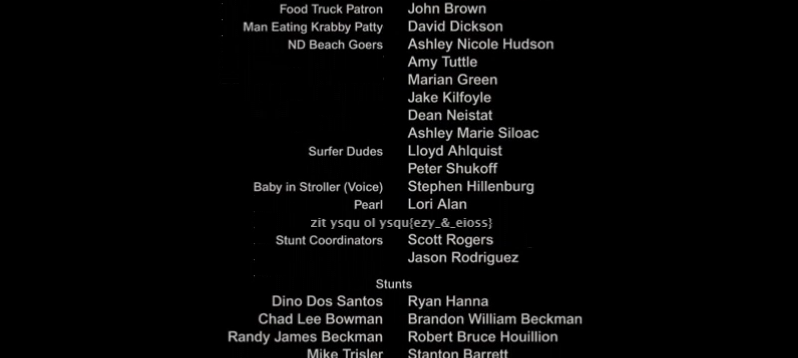

Steganography
===================

What's the difference - 500
----------
For this challenge, we are given a single png file titled 'bane.png' 


On initial inspection, everything seems to be in order. The only thing that seems out of place is the fact that the image is 27 mb.

So I examined the file a little more:

```
david@redacted: strings bane.png
IHDR
        pHYs
 cHRM
[IDATx
IEND
IHDR
        pHYs
 cHRM
[IDATx
IEND
```
What's odd here is that there are two IHDRs. Upon examination there are two PNG file headers. This means that bane.png is actually housing two files, which would explain the large file size. 

I opened it in a hex editor, and searched for "‰PNG", the PNG file header (or 89 50 4E 47 in hex). I found the second occurence of PNG and copied from 0x00000000 to 0xDF93D5. I saved that as 1.png, and then I copied from 0xDF93D5 to 0x1BF27AA. This gave me two files, but when I opened them they appeared to have the same image, identical to the original and eachother. The files were not identical though, looks can be deceiving. 
```
david@redacted: diff 1.png 2.png
Binary files 1.png and 2.png differ
```
and just to confirm:
```
david@redacted: md5 1.png 2.png
F1483C53E6559F6641B43C41B28C9ED2  1.png
0261AD87DBCDA7364F18EFA648BBAE9E  2.png
```
So these two files are different, but how? 
I can use imagemagick to diff the images, and save the output to an image.
```
compare 1.png 2.png  diff.png
```
And this gives us a new image:


We can scan this QR code and we get: flag{steeanography_is_the_bane_of_my_existance}
```
Flag: flag{steganography_is_the_bane_of_my_existance}
```
Movie Night - 150
----------
For this challenge all we are  given is a ~2 minute video from what appears to be the SpongeBob movie. It's the credits, and the hint tells us that they spotted something when watching it. Upon watching the video I noticed some text fly by the screen briefly. I wasn't able to pause the video at the exact time to be able to see the characters, so I split the video up into frames, and got this image:



The cipher text is: zit ysqu ol ysqu{ezy_&_eioss}
From this we can deduce that the cipher used was likely a simple one, as the: '_&_' and '{}' were preserved. 
The types of ciphers would either be a Rot-n, shift cipher, or a substituion cipher. 
I quickly ruled out the rot-n cipher, and moved on to the substitution. It was too short to be solved by something like [quipqiup](http://quipqiup.com), so it had to be solved manually. 
```
zit ysqu ol ysqu{ezy_&_eioss}
___ flag is flag{____&______}
```
Is what we know off the bat, since this is the formatting for flags, so we continue and plug in to get:
```
zit ysqu ol ysqu{ezy_&_eioss}
the flag is flag{_tf_&____ll}
```
The 'the' there is a guess, we continue like this and get:
the flag is flag{ctf_&_chill}

```
Flag: flag{ctf_&_chill}
```


